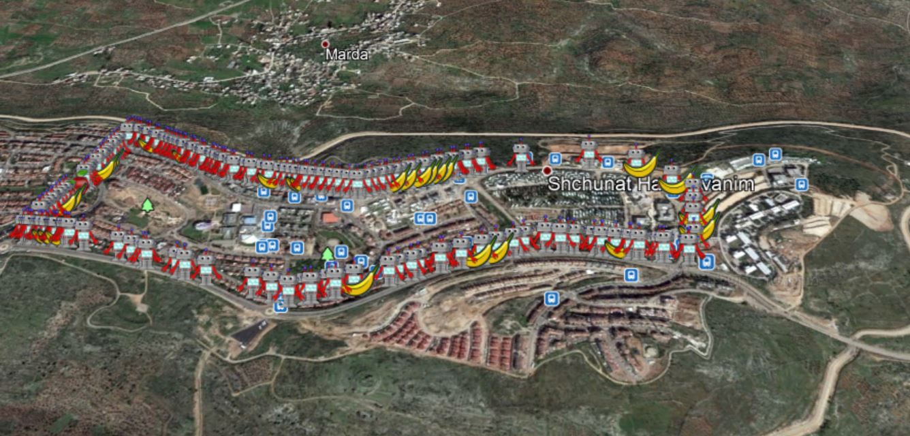
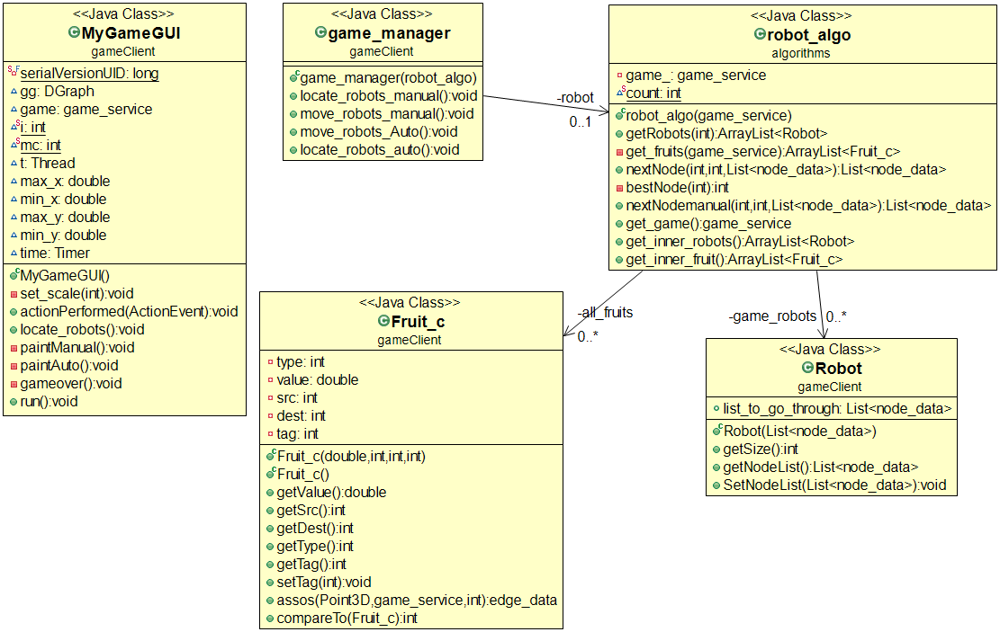
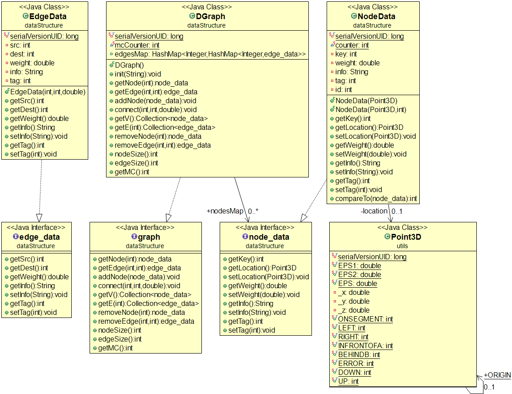

# The Maze Of Waze

### Introduction:

In This Project:
- develop the game "The Maze Of Waze"
which is based on assignment data and algorithmic data that underlies Assignment 2.
- Create *KML* Files - which record the game and can be viewed on Google Earth.

The project is based on building a real-time game of robots (objects) on a weighted graph and collecting fruits (objects) of numerical value ("coins") placed on the graph sides.\
**Game time:** 30-60 seconds.\
**Purpose of the game:** Obtain a maximum number of fruits that the robots collected together.

### How to play the game:

1. Choose level to play (0-23 options)

2. Choose a mode to play

#             Info

The-Maze-Of-Waze main goal is to collect as many fruits you can "eat", you can do it by two ways:
- Manual mode
- Auto mode

##      Manual Mode

In Manual mode first of all you place your robots on the nodes that you want, 
after that all you need to do is to decide which fruit you want to collect for each 
robot and so on until the game is over.

##      Auto Mode

In Auto mode sit back on your chair and let us do our best effort using our fine algorithms
in order to collect as much fruit in our given time we guarantee to the best result we can do!

##      KML

At the end of each level you have the chance to save your own result in a kml file ,
and analyze it.  
Here is an example for level 2:

## Game - Diagram

## DataStructure - Diagram

